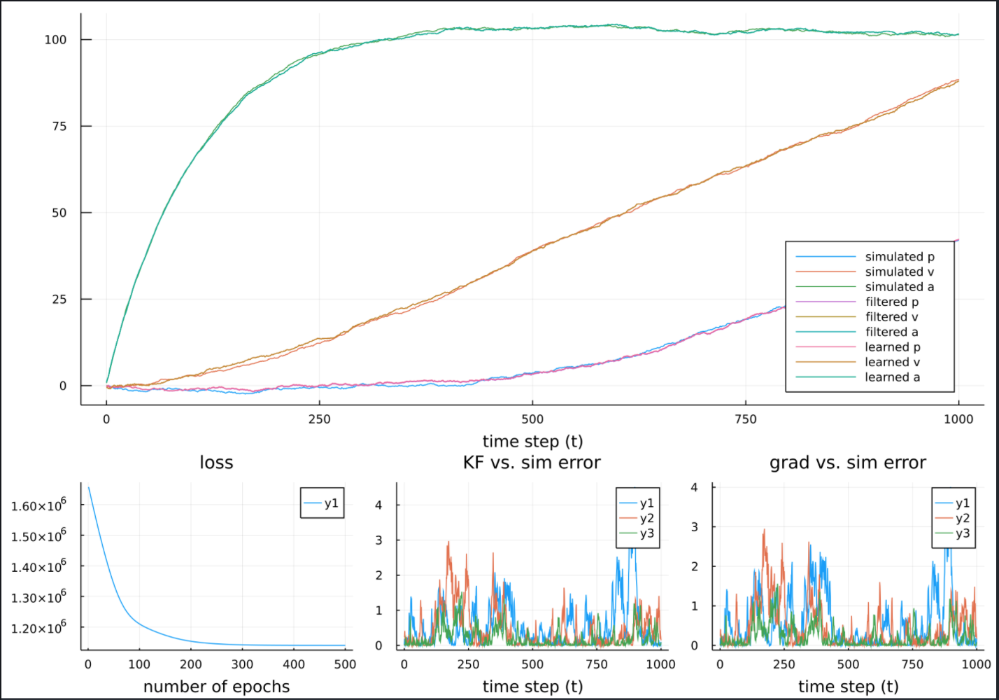
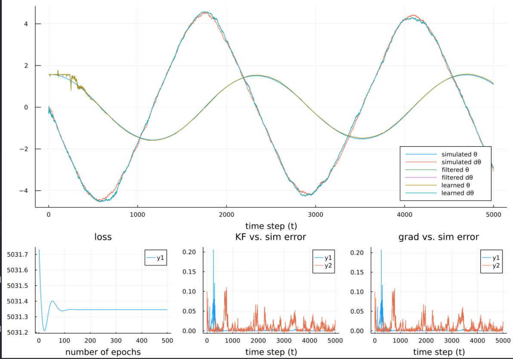

# KFEstimate.jl
KFEstimate is a [Julia](https://julialang.org/) package for parameter estimation in linear and non linear state space models, using [automatic differentiation](https://en.wikipedia.org/wiki/Automatic_differentiation). This is achieved by using stochastic gradient descent on a standard energy log-likelihood to compute a maximum a-priori (MAP) estimate of the model parameters

It is developped by Jean-Guillaume Brasier at [Inria Paris](https://www.inria.fr/en/centre-inria-de-paris) in the [DYOGENE](https://www.di.ens.fr/dyogene/) team.

```julia
pkg> add https://github.com/jgbrasier/KFEstimate.jl
```

### Parametrised State Space Models (PSSM)

If you are unfamiliar with Kalman Filtering see: [Kalman Filters](https://en.wikipedia.org/wiki/Kalman_filter)

This package supports standard KF and EKF filtering as well their parametrised version.


### Parameter Estimation

Traditional parameter estimation in SSMs is done using MCMC methods or [EM Algorithms](https://en.wikipedia.org/wiki/Expectation%E2%80%93maximization_algorithm).

Our gradient based approach consists of computing the log-likelihood of our posterior estimation and then minimizing it using stochastic gradient descent.

At each epoch e:
- filter measured states using classical KF or EKF algorithms, with current parameters θ.
- compute the gradient ∇ of the pre-fit residual likelihood ℒ.
- update the parameters θ.

### Automatic Differentiation (AD)
Often, manually calculating the gradient ∇ of the log-likelihood ℒ is intractable. However it is easily computed using standard AD libraries. In our case we use [Zygote](https://fluxml.ai/Zygote.jl/latest/) as it is readily implemented in [Flux](https://fluxml.ai/).

### Quick Start

- The package works with the States structure which encapsulates both the mean x and covariance P of a state
```julia
s = State(x::AbstractVector, P::AbstractMatrix)
```

- Setting up a Kalman Filter:
```julia
kf = KalmanFilter(A, B, Q, H, R)
```
here A, B, H, Q, R are all of type `AbstractMatrix`

- The package supports simulating measurements for a given action sequence (input vector)
```julia
sim_states, sim_measurements = run_simulation(filter::AbstractFilter, x0::AbstractVector, action_seq::AbstractArray)
```

- Classical KF filtering:
```julia
filtered_states = run_filter(filter::AbstractFilter, s0::State, action_history::AbstractArray,
    measurement_history::AbstractArray)
```

- Setting up an Parametrised Kalman Filter
```julia
param_kf = ParamKalmanFilter(A, B, Q, H, R)
```
A, B, H, Q, R must all be functions with input θ. See `/examples/linear_em.jl`

- Running gradient descent on unknown parameters θ for a given number of epochs:
```julia
θ, loss = run_kf_gradient(θ, param_kf::ParamKalmanFilter, s0::State, action_history::AbstractArray, measurement_history::AbstractArray,
    opt, epochs)
```
The package handily integrates [Flux Optimisers](https://fluxml.ai/Flux.jl/v0.4/training/optimisers.html).


### Examples

#### Linear
Parameter estimation for a classical dynamic model with control input where process matrix A is unknown: `example/linear_em.jl`



#### Non linear

Parameter estimation for a non linear pendulum model with no control input where coefficients (g/L) of state space process are unknown: `example/non_linear.jl`


