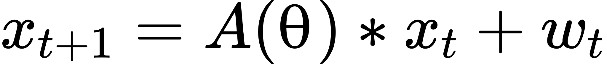
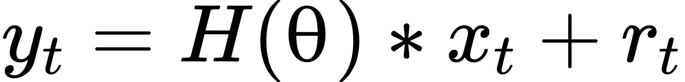
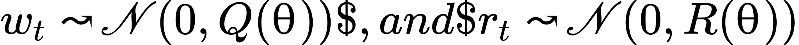
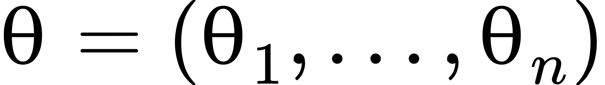
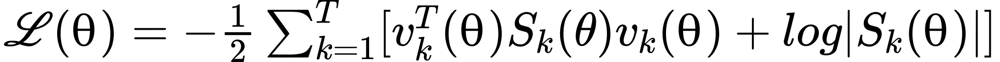
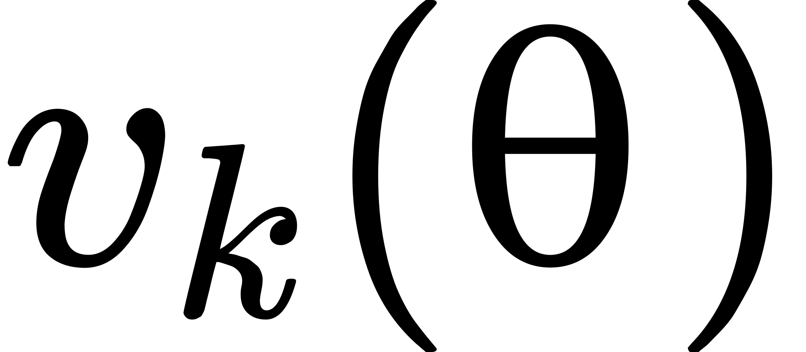
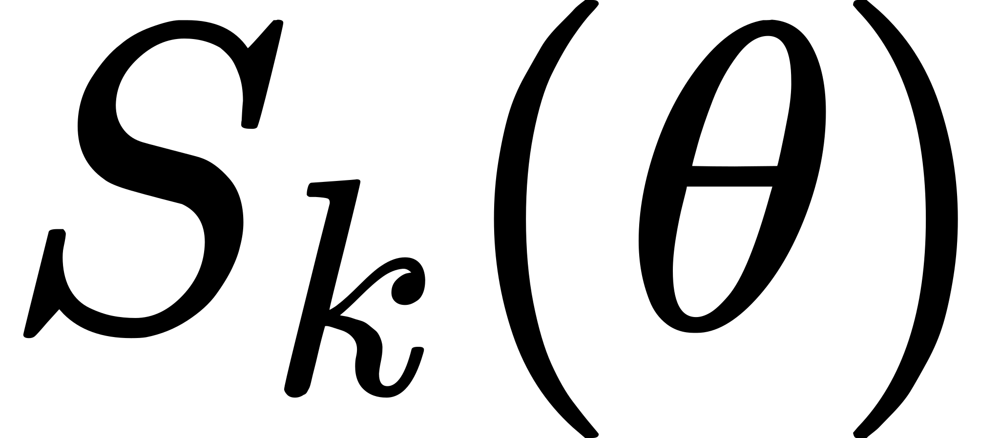

# KFEstimate.jl
KFEstimate is a [Julia](https://julialang.org/) package for parameter estimation in linear and non linear state space models, using [automatic differentiation](https://en.wikipedia.org/wiki/Automatic_differentiation). This is achieved by using stochastic gradient descent on a standard energy log-likelihood to compute a maximum a-priori (MAP) estimate of the model parameters

It is developped by Jean-Guillaume Brasier at [Inria Paris](https://www.inria.fr/en/centre-inria-de-paris) in the [DYOGENE](https://www.di.ens.fr/dyogene/) team.

### Parametrised State Space Models (PSSM)

If you are unfamiliar with Kalman Filtering see: [Kalman Filters](https://en.wikipedia.org/wiki/Kalman_filter)

Let us consider a simple parametrised state space model:

- <!-- $x_{t+1} = A(θ)*x_t + w_t$ --> 
- <!-- $y_t = H(θ)*x_t + r_t$ --> 

where:
- <!-- $w_t↝𝒩(0, Q(θ))$, and $r_t↝𝒩(0, R(θ))$ --> 
- A(θ) and H(θ) are the process and measurement matrices respectively.

Here <!-- $θ = (θ_1, ..., θ_n )$ -->  represents unknown parameters in our model that we would like to estimate.

### Parameter Estimation

Traditional parameter estimation in SSMs is done using MCMC methods or [EM Algorithms](https://en.wikipedia.org/wiki/Expectation%E2%80%93maximization_algorithm).

Our gradient based approach consists of computing the log-likelihood of our posterior estimation and then minimizing it using stochastic gradient descent.

At each epoch e:
- filter measured states using classical KF or EKF algorithms, with current parameters $θ$.
- compute the gradient ∇ of <!-- $ℒ(θ)= -\frac{1}{2}\sum_{k=1}^{T}[v^T_k(θ)S_k(\theta)v_k(θ)+log|S_k(θ)|]$ --> 

where <!-- $v_k(θ)$ -->  is the innovation or (measurement pre-fit residual), and <!-- $S_k(\theta)$ -->  is the innovation (or pre-fit residual) covariance.
- update the parameters θ.

### Automatic Differentiation (AD)
Often, the manually calculating the gradient ∇ of the log-likelihood ℒ is intractable. However it is easily computed using standard AD libraries. In our case we use [Zygote](https://fluxml.ai/Zygote.jl/latest/) as it is readily implemented in [Flux](https://fluxml.ai/).
